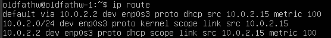

## Part 1. Установка ОС

* Результат вызова команды `cat /etc/issue`

## Part 2. Создание пользователя
* Вызов команды для создания пользователя

* Вывод команды 'cat /etc/passwd'

## Part 3. Настрока сети

* 3.1	`sudo nano /ets/hostname` заменила oldfathw_srv на oldfathw-1

* 3.2	`timedatectl list-timezones` - список доступных поясов, 
		`sudo timedatectl set-timezone Europe/Moscow` - установка часового пояса системы, 
		`timedatactl` - проверка локального времени.

* 3.3	`ip link show` - показать сетевые интерфейсы, 

Названия сетевых интерфейсов.

lo - виртуальный сетевой интерфейс, стандартная часть стека протоколов TCP/IP. Используется для служебных целей (диагностика), клиент-серверных приложений, установленных на этой же системе.

* 3.4	DHCP - это клиент-серверный протокол динамической конфигурации хоста (Dynamic Host Configuration Protocol), с помощью которого в ИТ-инфраструктуре сетевые параметры каждого нового устройства прописываются автоматически.

* 3.5	Внутренний IP-адрес маршрутизатора - это то, что вы используете для разговора с маршрутизатором. Используйте этот IP-адрес для входа в маршрутизатор и настройки его для таких вещей, как переадресация портов.

Внешний IP-адрес вашего маршрутизатора - это то, что остальной мир использует, чтобы найти вас в Интернете. Сообщите этот IP-адрес людям, которые пытаются подключиться к вам, если вы размещаете игру или другой вид на сервер.

* 3.6	Изменение файла конфигурации интерфейсов `/etc/netplan/*.yaml`

* 3.7 изменения всупили в силу
 

Проверим пингуется ли...

Да!

## Part 4. Обновление ОС

